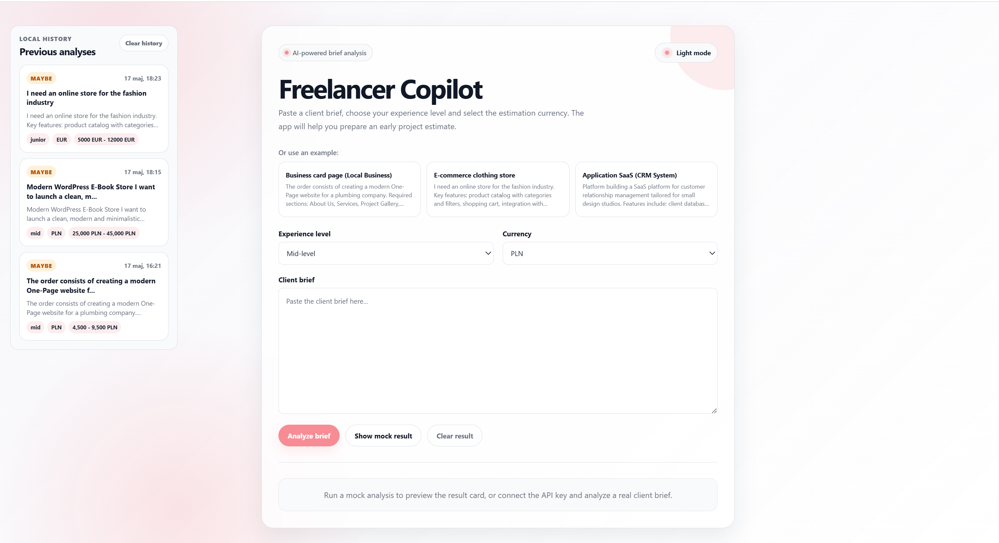
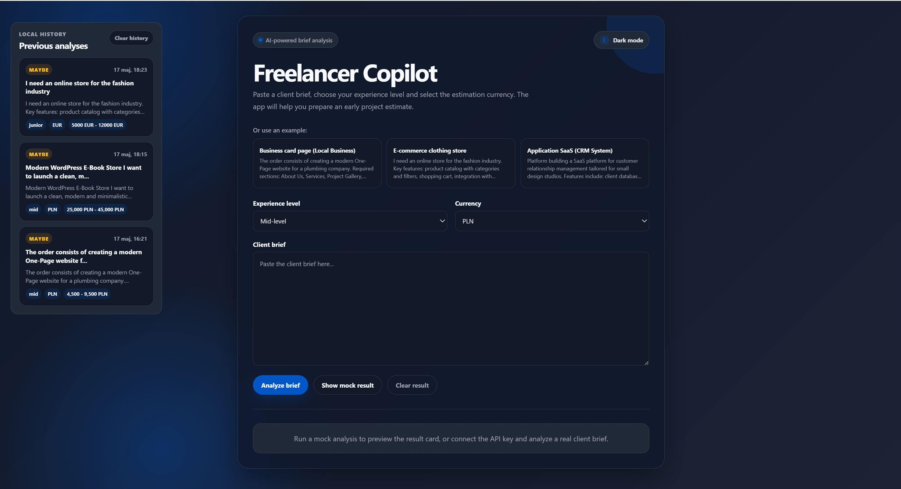
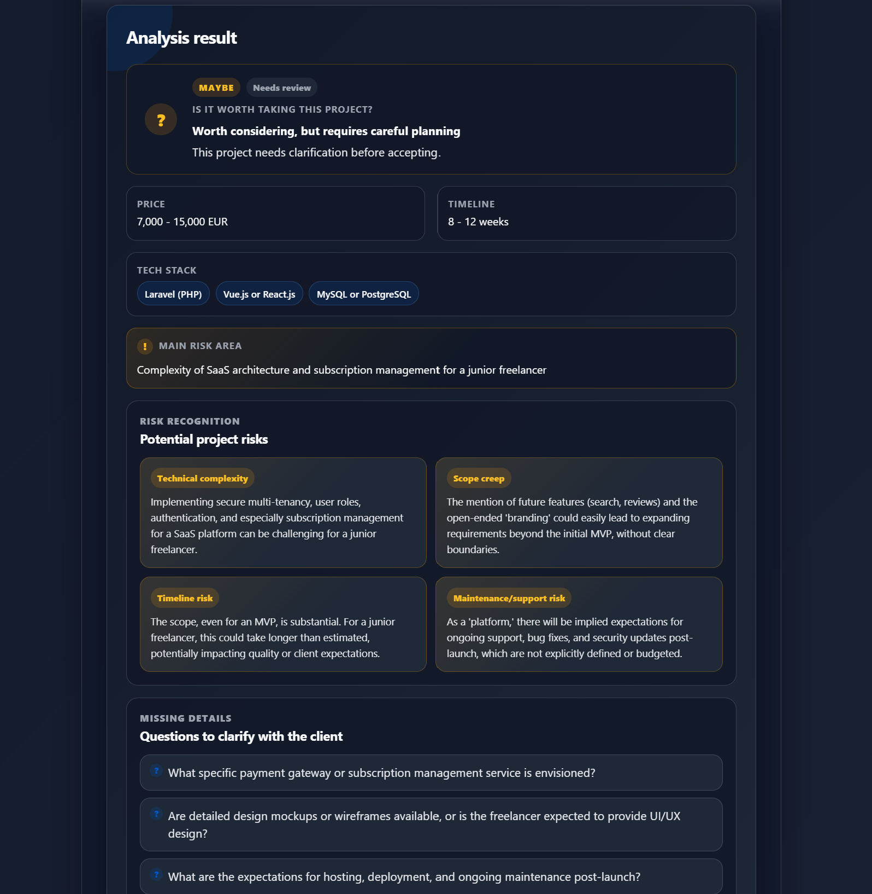
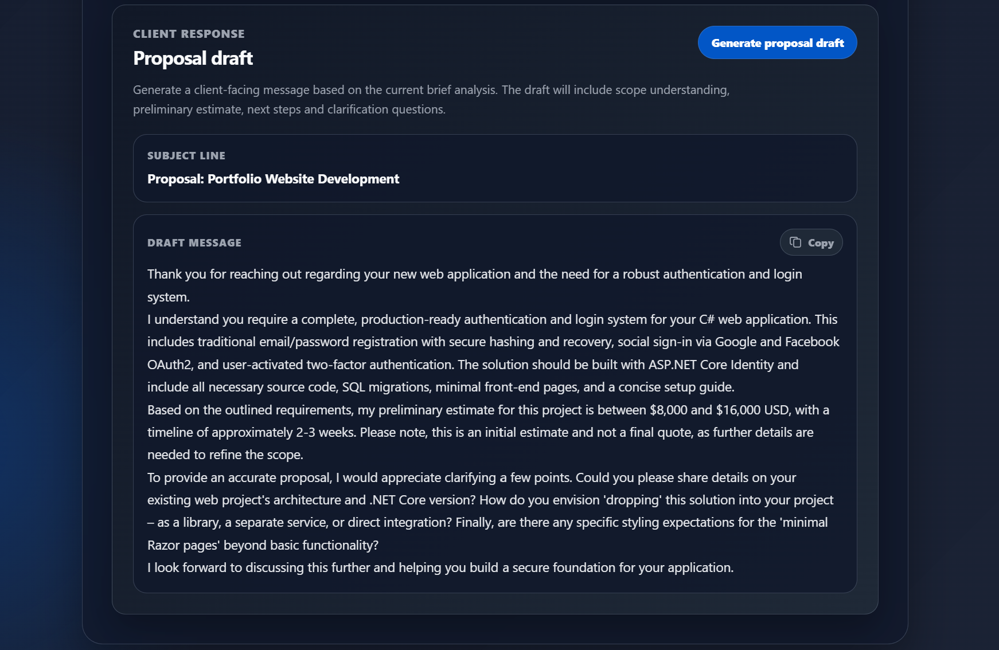
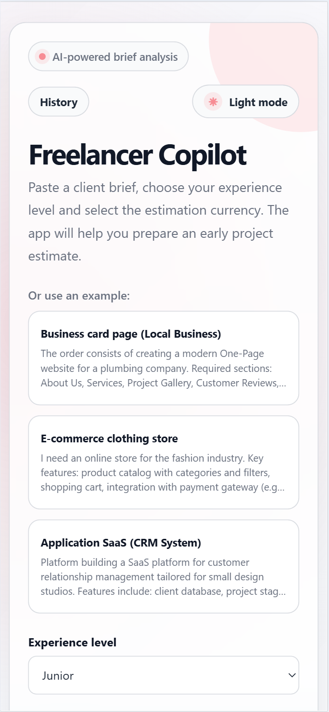

# Freelancer Copilot

Freelancer Copilot is an AI-powered web application that helps freelancers analyze client project briefs and prepare better project estimates.  
The app uses Google Gemini to identify project scope, estimate price and timeline, detect potential risks, highlight missing details, and generate a client-facing proposal draft.

The goal of the project is to support freelancers during the early decision-making stage: before accepting a project, preparing a quote, or replying to a client.

---

## Preview

### Light mode



### Dark mode



### Analysis result



### Proposal draft



### Mobile view


---

## Features

### AI brief analysis

The user can paste a client project brief and receive an AI-generated analysis containing:

- estimated price range,
- estimated timeline,
- recommended tech stack,
- project summary,
- decision recommendation: `YES`, `MAYBE`, or `NO`,
- main risk area,
- detailed risk recognition,
- missing details to clarify with the client.

The analysis is generated with Google Gemini 2.5 Flash through a Node.js/Express backend.

---

### Risk recognition

The app identifies potential project risks, such as:

- missing details,
- budget mismatch,
- scope creep,
- technical complexity,
- timeline risk,
- integration risk,
- maintenance or support risk.

This helps the freelancer understand what should be clarified before accepting the project.

---

### Missing details checklist

Freelancer Copilot extracts questions and missing information that should be discussed with the client before preparing a final quote.

Examples:

- What is the expected budget range?
- Which features are required for the MVP?
- Who will provide content, assets, and product data?
- What hosting or deployment environment is expected?
- Is post-launch support included?

---

### Proposal draft generation

After analyzing a brief, the user can generate a client-facing proposal draft.

The proposal includes:

- a short greeting,
- understanding of the project scope,
- preliminary price and timeline estimate,
- suggested next steps,
- clarification questions,
- professional closing.

The proposal is generated only when the user clicks the `Generate proposal draft` button, so it does not consume API tokens unnecessarily.

A copy button allows the user to quickly copy the generated proposal draft.

---

### Local analysis history

The application stores previous analyses in the browser using `localStorage`.

The user can:

- view previous analyses in a sidebar,
- restore a previous analysis,
- return directly to the analysis result,
- clear local history.

On desktop, the history is displayed as a sidebar.  
On smaller screens, it is available through a mobile drawer.

---

### Light and dark mode

The app supports both light and dark themes.

- Light mode uses a clean white interface with a pink accent color.
- Dark mode uses a dark navy/gray interface with a blue accent color.

The selected theme is stored in `localStorage`, so the user’s preference is preserved after refreshing the page.

---

### Custom UI states

The app includes custom interface states such as:

- loading modal while the brief is being analyzed,
- inline loading bar while the proposal draft is being generated,
- custom error modal for missing or invalid API keys,
- empty history state,
- responsive mobile history drawer.

---

## Tech Stack

### Frontend

- React
- Vite
- CSS3
- localStorage
- Fetch API

### Backend

- Node.js
- Express.js
- CORS
- dotenv

### AI Engine

- Google Gemini 2.5 Flash API

---

## Project Structure

```text
FreelancerCopilot/
├── backend/
│   ├── server.js
│   ├── package.json
│   ├── package-lock.json
│   └── .env
│
├── frontend/
│   ├── src/
│   │   ├── components/
│   │   │   ├── AnalysisHistory.jsx
│   │   │   ├── BriefForm.jsx
│   │   │   ├── ErrorModal.jsx
│   │   │   ├── LoadingModal.jsx
│   │   │   ├── ProposalDraftCard.jsx
│   │   │   ├── ResultCard.jsx
│   │   │   └── ThemeToggle.jsx
│   │   │
│   │   ├── data/
│   │   │   └── examples.js
│   │   │
│   │   ├── styles/
│   │   │   ├── App.css
│   │   │   ├── forms.css
│   │   │   └── result-card.css
│   │   │
│   │   ├── utils/
│   │   │   ├── analysisHistoryStorage.js
│   │   │   ├── mockResult.js
│   │   │   └── themeStorage.js
│   │   │
│   │   ├── api.js
│   │   ├── App.jsx
│   │   └── main.jsx
│   │
│   ├── index.html
│   ├── vite.config.js
│   ├── package-lock.json
│   └── package.json
│
└── README.md
```

## Installation & Setup

### 1. Prerequisites
* [Node.js](https://nodejs.org/) installed.
* A Google Gemini API Key. You can get one at [Google AI Studio](https://aistudio.google.com/).

### 2. Backend Setup
1.  Open your terminal and navigate to the backend folder:
    ```bash
    cd backend
    ```
2.  Install dependencies:
    ```bash
    npm install
    ```
3.  Create a `.env` file in the `backend` directory and add your API key:
    ```env
    GEMINI_API_KEY=your_api_key_here
    PORT=3002
    ```
4.  Start the backend server:
    ```bash
    node server.js
    ```
    *The server will run on `http://localhost:3002`. You can verify if the server is alive by visiting `http://localhost:3002/` in your browser.*

### 3. Frontend Setup
1.  Open a **new** terminal window and navigate to the frontend folder:
    ```bash
    cd frontend
    ```
2.  Install dependencies:
    ```bash
    npm install
    ```
3.  Start the development server:
    ```bash
    npm run dev
    ```
4.  Open your browser at the URL shown in the terminal (usually `http://localhost:5173`).

---

## Usage

1.  Enter your project brief or client requirements into the text area.
2.  Select the desired seniority level and currency.
3.  Click **"Analyze brief"**.
4.  Review the AI-generated estimate and professional summary.

---

## Security Note
The `.env` file contains sensitive information (API Keys). It is listed in `.gitignore` and should **never** be committed to public repositories. Use the provided `.env.example` as a template for new environments.
